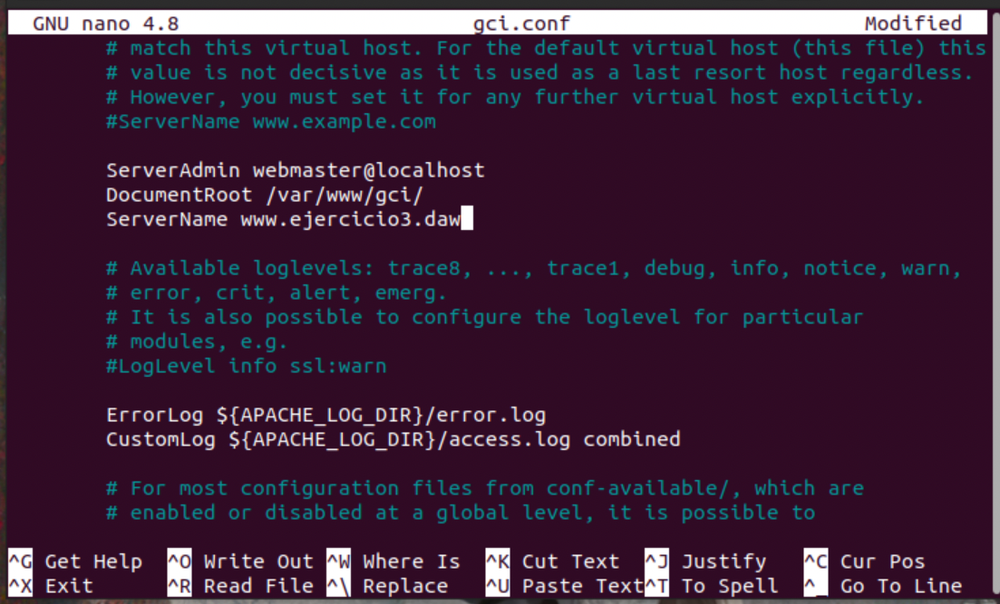

# **Ejercicio2**

[Marinela Mihaylova](https://github.com/intkai)

## **Resumen**

Markdown acerca del ejercicio tres del examen de la primera evaluación de la asignatura de despliegue de aplicaciónes web. Este ejercicio se ha basado en el tema de apache.

## **Índice**

- [**Ejercicio2**](#ejercicio2)
  - [**Resumen**](#resumen)
  - [**Índice**](#índice)
  - [**Introducción**](#introducción)
  - [**Realización. Paso a Paso**](#realización-paso-a-paso)
  - [**Bibliografía**](#bibliografía)

## **Introducción**

Es una práctica que hemos realizado varias veces debido a que hemos hecho trabajos opcionales como el de SSH pero por alguna razón en este caso no ha llegado a funcionar correctamente

## **Realización. Paso a Paso**

En este caso partimos de que apache ya estaba instalado con antelación así que nos hemos saltado muchos pasos. Puede que ahí resida la razón por la que no ha llegado a funcionar de ninguna manera.

En primer lugar he optado por reciclar un ejercicio ya hecho con antelación para uno de los entregables. Contenido en la carpeta var/www/gci

He editado el archivo a lo correspondiente que se pedía en la práctica actual.

Una vez guardado he procedido a dirigirme al directorio /sites-available/ situado en /etc/apache2 para crear una copia de seguridad a gci.conf y editar este.

He cambiado el serverName al requerido en el ejercicio y he dejado el DocumentRoot al que estaba, ya que estaba reciclando el mismo de la última vez.

Después he procedido a realizar los comandos necesarios para actualizar y poder ver el contenido

Y por último en la carpeta /etc/ he modificado el archivo hosts donde he asociado el loopback al ServerName que he declarado en el fichero anterior.

Resultado: **_No va_**

## **Bibliografía**

[Apache](https://github.com/Intkai/apache/blob/main/apache.md)
